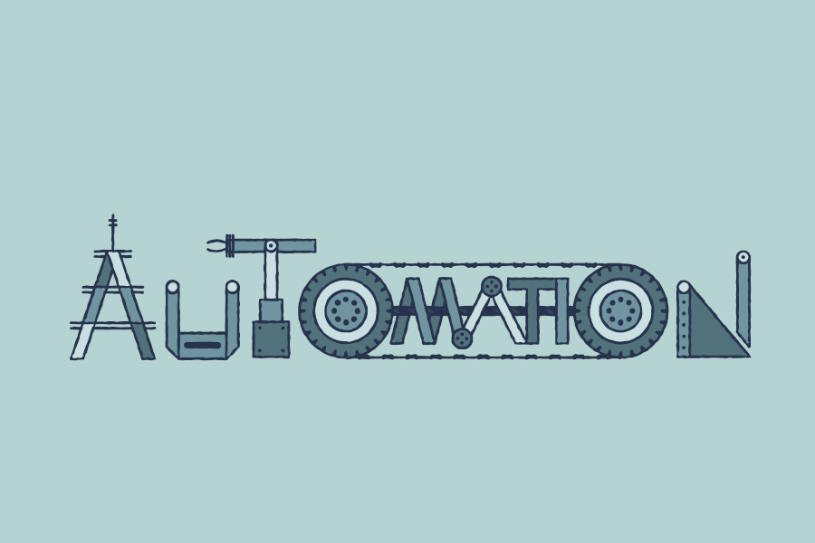

# Hi, I'm Geraldine 👋🏻‍💻

 *I'm a professional front-end developer with self-taught skills and a passion for constant learning. I have the ability to approach and solve complex problems, which allows me to step out of my comfort zone to achieve each of the goals that I set for myself or that are assigned to me.*

 *I am currently looking for the opportunity to grow in the test automation branch and become a team leader in that specialization.*

 
 ***

## 💬  About Me
* 🔭   Exploring new technologies.
* 🎓   FullStack Development from Holberton School
* 👯   Looking to collaborate on learning new technologies.
* 🌱   Still learning about JavaScript, Angular, Java.

## 🛠  Tech Stack

### QA Automation

| 💻 | 🌐 | 👀 | 📖 | 🛢 | ⚙️ | 🔧 |
| ---|---|---|---| ---| ---	| ---|
|	||	|||	|	|
|	|		|	||	|	||
|	|		|	|	 |		|	|		|

### Developer
| 💻 | 🌐 | 🛢 | ⚙️ | 🔧 |
| --- | --- | --- | --- | --- |
|  |  |  |  |  |
|  |  |  |  |  |
|  |  |  |  |  |
|  |  |  |  |  |
|  |  |  |  |  |
|  |  |  |  |  |

## 👅 Top langs 

## 🎹 Profile stats

## 📫 Connect with Me

***
✒️ From [Geraldine Meneses](https://github.com/nitaly31)
